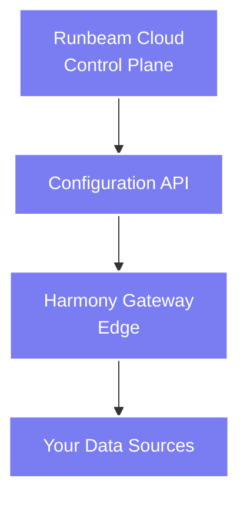

# Runbeam Cloud

Centralized management platform for your data integration infrastructure.

## Overview

Runbeam Cloud is a web-based control plane for managing Harmony Proxy instances and configuring data integration pipelines. It provides a unified interface for teams to collaborate on building and maintaining secure, scalable data meshes.

## Key Features

### Gateway Management

Configure and monitor Harmony Proxy instances from a central location:

- **Register Gateways** - Add Harmony instances to Runbeam Cloud
- **Configuration** - Define services, endpoints, and pipelines
- **Monitoring** - Track gateway health and activity
- **Authorization** - Issue machine tokens for autonomous operation

### Service Configuration

Define the services that your gateways will expose:

- **Endpoints** - HTTP/FHIR/DICOM/DICOMweb routes
- **Backends** - Where requests are processed (HTTP, DICOM, etc.)
- **Pipelines** - Ordered middleware for transformations and authentication
- **Hot Reload** - Push configuration updates without downtime

### Team Collaboration

Work with your team on integration projects:

- **Role-Based Access** - Control who can view and modify configurations
- **Team Workspaces** - Isolate projects and environments
- **Audit Logging** - Track configuration changes
- **API Access** - Programmatic configuration management

### Security & Authentication

Built-in security features:

- **OAuth/OIDC Integration** - Enterprise authentication
- **Machine Tokens** - 30-day scoped credentials for gateways
- **API Tokens** - Programmatic access with granular permissions
- **JWT Validation** - RS256 signature verification

## How It Works

1. **Create an Account** - Sign up at [runbeam.io](https://runbeam.io)
2. **Register a Gateway** - Add your Harmony Proxy instance
3. **Configure Services** - Define endpoints, backends, and pipelines
4. **Authorize** - Use the CLI or SDK to authorize your gateway
5. **Deploy** - Harmony pulls configuration automatically

## Architecture

Runbeam Cloud never touches your data - it only manages configuration. Harmony Proxy runs at the edge, near your data sources, and processes requests locally.

## API Access

Runbeam Cloud provides a RESTful API for programmatic access:

- **Gateway Management** - List, create, update, delete gateways
- **Service Management** - Configure services and endpoints
- **Pipeline Management** - Define transformation and auth pipelines
- **Token Management** - Issue and revoke access tokens

Use the [Runbeam SDK](/sdk) or [CLI](/cli) to interact with the API.

## Next Steps

1. [Install Harmony →](/harmony/installation)
2. [Learn about Gateway configuration →](/harmony/configuration)
